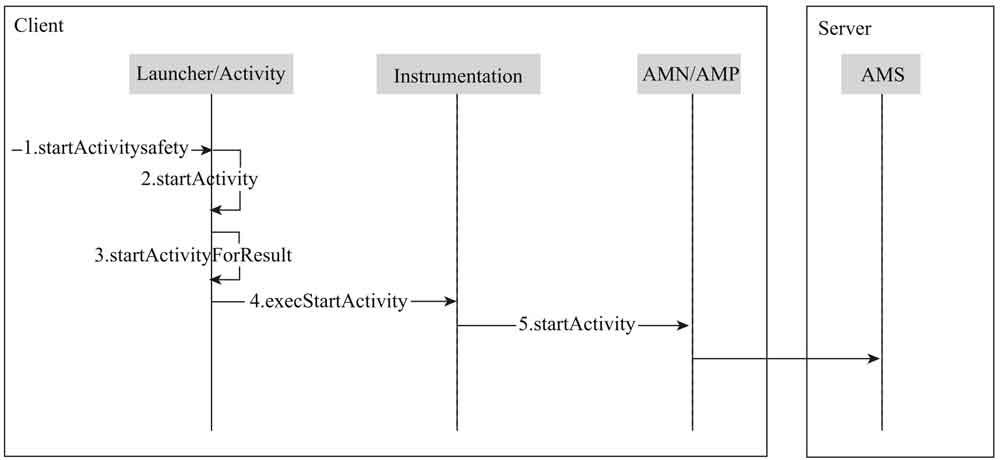
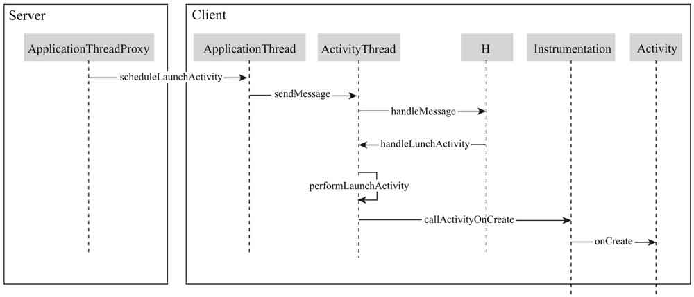

## <center> startActivity 的时序图之上半场</center>



- Activity 的 startActivityForResult 方法
- Activity 的 mInstrumentation 字段
- AMN 的 getDefault 方法获取到的对象

<hr>

## <center> startActivity 的时序图之下半场</center>



- H 的 mCallback 字段
- ActivityThread 的 mInstrumentation 对象，对应的 newActivity 方法和 callActivityOnCreate 方法

1. 重写 Activity 的 startActivityForResult 方法

   该方法就是简单的重写父类方法

2. 对 Activity 的 mInstrumentation 字段进行 Hook

   该方法是将 Activity 中的 mInstrumentation 通过反射的方法修改为我们自己的 Instrumenttation 的子类，再调用父类的方法前后可做其他操作

```java
    //通过反射修改mInstrumentation字段为我们自定义的子类
    //Activity的这个mInstrumentation字段是private的，只能通过反射来获取到这个对象
    Instrumentation mInstrumentation = (Instrumentation) RefInvoke
                    .getFieldObject(Activity.class, this, "mInstrumentation");
    EvilInstrumentation evilInstrumentation = new EvilInstrumentation(mInstrumentation);
    RefInvoke.setFieldObject(Activity.class, this, "mInstrumentation",evilInstrumentation);

    /**
     * 自定义nstrumentation的子类
    **/
    public class EvilInstrumentation extends Instrumentation {

    private static final String TAG = "EvilInstrumentation";
    private Instrumentation mBase;

    public EvilInstrumentation(Instrumentation mBase) {
        this.mBase = mBase;
    }


    public ActivityResult execStartActivity(
            Context who, IBinder contextThread, IBinder token, Activity target,
            Intent intent, int requestCode, Bundle options) {
        Log.d(TAG, "execStartActivity: Π大星到此一游!");
        Class[] p1 = {Context.class, IBinder.class, IBinder.class, Activity.class,
                Intent.class,int.class, Bundle.class};
        Object[] v1 = {who, contextThread, token, target, intent, requestCode, options};
        return (ActivityResult) RefInvoke.invokeInstanceMethod(mBase, "execStartActivity", p1, v1);
    }
}
```

3. 对 AMN 的 getDefault 方法进行 Hook

   在书中的 andrid 版本对应的 AMN 是 ActivityManagerNative 和 getDefult()方法，且该方法返回的对象为 IActivityManager 的单例对象 gDefult;而现在是 ActivityTaskService 和 getService 方法，但是返回的对象是 IActivityTaskManager 的单例对象 IActivityTaskManagerSingleton,所以获取静态的单例对象的字段是*IActivityTaskManagerSingleton*

```java

/**
* 该类的作用是Hook ActivityTaskManager类中的单例对象IActivityTaskManagerSingleton的mInstace
**/
public class AMSHookHelper {

    private static final String TAG = "AMSHookHelper";
    private static final String EXTRA_TARGET_INTENT = "extra_target_intent";

    public static void hookMAN() throws ClassNotFoundException {
        // 获取ActivityTaskManager对象中的静态字段IActivityTaskManagerSingleton
        Object iActivityTaskManager = RefInvoke.getStaticFieldObject(
                "android.app.ActivityTaskManager", "IActivityTaskManagerSingleton");
        // IActivityTaskManagerSingleton是一个Singleton<T>对象，接着获取设置单例中的实例对象mInstance,
        // 而mInstance是IActivityTaskManager的实例对象，我们在此hook该对象
        Object mInstance = RefInvoke.getFieldObject("android.util.Singleton", iActivityTaskManager, "mInstance");
        Class<?> classB2Interface = Class.forName("android.app.IActivityTaskManager");
        //通过Proxy.newProxyInstance()创建上文提到的mInstance的代理对象，通过该代理对象可以在调用方法前后添加其他操作
        Object proxy = Proxy.newProxyInstance(Thread.currentThread().getContextClassLoader(), new Class<?>[]{classB2Interface},
                new MockClass1(mInstance));
        RefInvoke.setFieldObject("android.util.Singleton", iActivityTaskManager, "mInstance", proxy);
    }
}

/**
* 代理对象
**/
public class MockClass1 implements InvocationHandler {

    private static final String TAG = "MockClass1";
    private Object mInstance;

    public MockClass1(Object instance) {
        this.mInstance = instance;
    }

    @Override
    public Object invoke(Object proxy, Method method, Object[] args) throws Throwable {

        if(method.getName().equals("startActivity")){
            Log.e(TAG, "invoke: " + method.getName() + "  Π大星到此一游!");
        }
        return method.invoke(mInstance, args);
    }
}

/**
 * 在activity中进行hook是因为attachBaseContext函数调用比onCreate()调用更早，hook尽量要早一些完成，也
 * 可以在application中完成（最好）
 **/

@Override
protected void attachBaseContext(Context newBase) {
    super.attachBaseContext(newBase);
    try {
        AMSHookHelper.hookMAN();
    } catch (Exception e) {
        e.printStackTrace();
    }
}
```

4. 对 H 类的 mCallback 字段进行 Hook

   先获取 ActivityThread 中的 sCurrentActivityThread 的静态变量，然后获取 sCurrentActivityThread 变量中的 Handle 对象,最后对 Handler 对象的 mCallback 对象进行 hook

```java
/**
 *
 **/
public class HookHelper {

    private static final String TAG = "HookHelper";

    public static void attachBaseContext() {
        Object currentActivityThread = RefInvoke.getStaticFieldObject("android.app.ActivityThread", "sCurrentActivityThread");
        Log.d(TAG, "attachBaseContext: " + (currentActivityThread == null));
        Handler mH = (Handler) RefInvoke.getFieldObject("android.app.ActivityThread", currentActivityThread, "mH");
        RefInvoke.setFieldObject(Handler.class, mH, "mCallback", new MockClass2(mH));
    }
}

/**
 *
 **/
public class MockClass2 implements Handler.Callback{
    private static final String TAG = "MockClass2";
    private Handler mH;
    public MockClass2(Handler H) {
        mH = H;
    }

    @Override
    public boolean handleMessage(@NonNull Message msg) {
        Log.d(TAG, "handleMessage: " + msg.what);
        Object obj = msg.obj;
        if (obj != null) {
            Log.d(TAG, "handleLaunchActivity: " + obj.toString());
        }
        switch (msg.what){
            case 100:
                handleLaunchActivity(msg);
                break;
        }
        mH.handleMessage(msg);
        return true;
    }

    private void handleLaunchActivity(Message msg) {
        Object obj = msg.obj;
        Log.d(TAG, "handleLaunchActivity: " + obj.toString());
    }
}
```

5. 再次对 Instrumentation 字段进行 Hook

   ActivityThread 中也有 mInstrumentation 字段，使用前面相同的方法对其进行 hook

```java
    public static void attachContext() {
        Object currentActivityThread = RefInvoke.invokeStaticMethod("android.app.ActivityThread", "currentActivityThread");
        Instrumentation mInstrumentation = (Instrumentation) RefInvoke.getFieldObject("android.app.ActivityThread", currentActivityThread, "mInstrumentation");
        EvilInstrumentation evilInstrumentation = new EvilInstrumentation(mInstrumentation);
        RefInvoke.setFieldObject(currentActivityThread,"mInstrumentation", evilInstrumentation);
    }

    /**
     * Instrumentation子类中的新增方法及ActivityThread会在Activity跳转的时候调用的方法
     **/

    @Override
    public Activity newActivity(ClassLoader cl, String className, Intent intent) throws ClassNotFoundException, IllegalAccessException, InstantiationException {
        Log.d(TAG, "newActivity: Π大星到此一游!");
        return mBase.newActivity(cl, className, intent);
    }

    @Override
    public void callActivityOnCreate(Activity activity, Bundle icicle) {
        Log.d(TAG, "callActivityOnCreate: Π大星到此一游!");
        mBase.callActivityOnCreate(activity, icicle);
    }
}
```

6. 对 ActivityThread 的 mInstrumentation 字段进行 Hook

   ContextImpl 的 startActivity 方法，会调用 ActivityThread 的 mInstrumentation 字段的 execStartActivity 方法，所以同样是对 ActivityThread 的 mInstrumentation 字段进行 Hook，但是这个是当使用 Context 的 startActivity()有效的 hook
